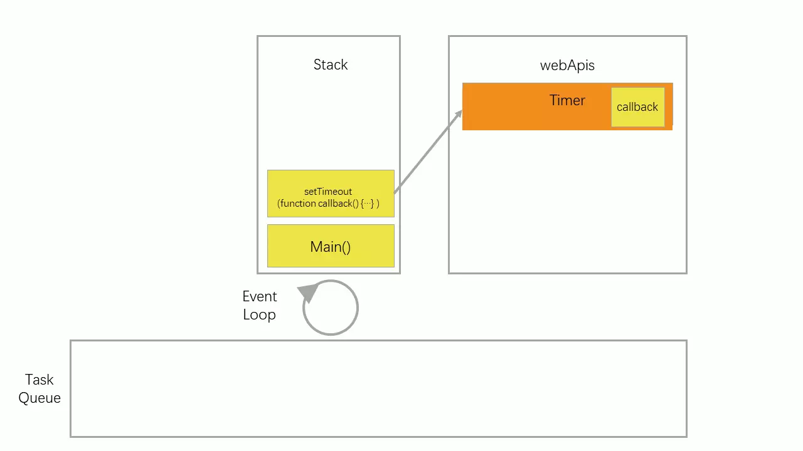

# JavaScript 浏览器环境执行顺序

> 浏览器环境与 nodejs 环境调用 api 不同，本文只介绍浏览器环境的JS执行顺序

### 名词解释

- JS 执行栈 (Stack): 正在执行的代码，先进后出
- 任务队列 (Task Queue): 或称为“宏观任务(Macrotask)队列”， 专门存放异步任务的队列
- 微观任务队列 (Microtask Queue): 专门存放异步微观任务的队列

> Microtask 以及 Macrotask 都属于异步任务，它们各自包括如下api：
> - Microtask：process.nextTick，Promises，MutationObserver；
> - Macrotask：setTimeout，setInterval，setImmediate 等。


#### 同步代码执行顺序

```js
1   console.log('script start');
2   console.log('script end');
```


- JS引擎将脚本内容包裹在`Main`函数内，并放入Stack
- 将代码`1`放入Stack，如上图所示，打印 `'script start'` 后出栈
- 将代码`2`放入Stack，打印 `'script end'` 后出栈
- `Main`出栈，执行完成

`Main`进栈、出栈每次都将执行，以下将**省略**这两步的解释。

#### 异步代码执行顺序

```js
1   console.log('script start');
2   setTimeout(function callback() {
      console.log('setTimeout');
    }, 0);
3   console.log('script end');
```

- `1` 进入 Stack，打印 `script start` 后出栈
- `2` 将执行 **WebAPIs** 中的 `setTimeout` 返回一个`Timer`后出栈，如下图 
  

  - 浏览器运行 `timer` 完成后，在 `Task Queue` 中创建任务
    

- `3` 进入 Stack，打印 `script end` 后出栈
- `Main` 出栈，此时 Stack 为空
- 将 `Task Queue` 中第一个任务入栈，即 `timer` 对应的 `callback` 入栈，打印 `'setTimeout'` 后出栈
- 由于 `Task Queue` 此时为空，脚本执行结束

#### 带微观异步代码执行顺序

```js
1   console.log("script start");

2   setTimeout(function() { 
      console.log("setTimeout");
    }, 0);

3   new Promise(function(resolve) {
        console.log("promise1");
        resolve();
4   }).then(function() {
        console.log("promise2");
5    }).then(function() {
        console.log("promise3");
    });

6   console.log("script end");
```


如上图，微观任务有专门的队列，在 `4`、`5` 中会把任务添加至此队列中，`6`执行完成后会优先执行 `MicroTask Queue` 任务，而且是不断获取任务，直至为空，然后从 `Task Queue` 中每次获取一个任务执行。