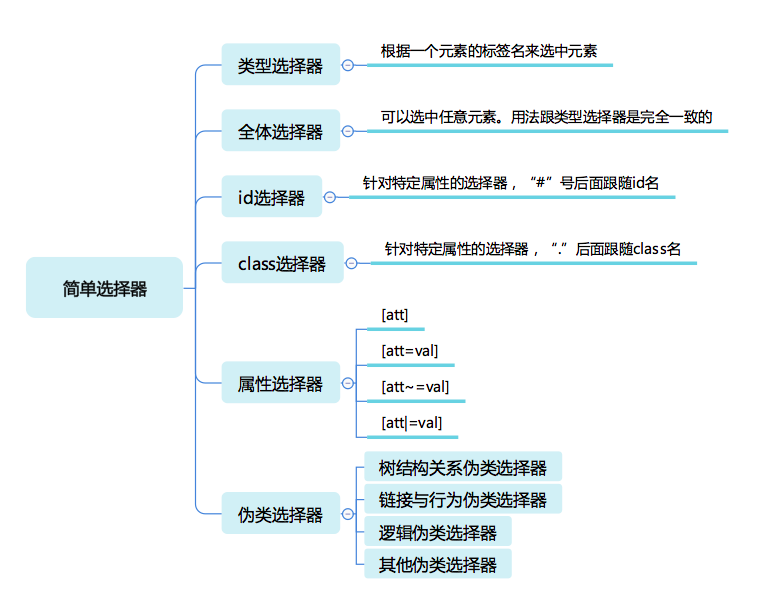

# CSS 选择器

## 简单选择器



### 类型选择器和全体选择器

根据一个元素的标签名来选中元素:

```css
div {...}
```

实际环境中还需要考虑 HTML 或 XML 元素的命名空间问题.

如 svg 和 HTML 中都有 a 元素, 如果要区分选择则需要使用带命名空间的类型选择器:

```html
<!DOCTYPE html>
<html>
  <head>
    <meta charset="utf-8" />
    <title>JS Bin</title>
  </head>
  <body>
    <svg
      width="100"
      height="28"
      viewBox="0 0 100 28"
      version="1.1"
      xmlns="http://www.w3.org/2000/svg"
      xmlns:xlink="http://www.w3.org/1999/xlink"
    >
      <desc>Example link01 - a link on an ellipse</desc>
      <a xlink:href="http://www.w3.org">
        <text y="100%">name</text>
      </a>
    </svg>
    <br />
    <a href="javascript:void 0;">name</a>
  </body>
</html>
```

```css
@namespace svg url(http://www.w3.org/2000/svg);
@namespace html url(http://www.w3.org/1999/xhtml);
svg|a {
  stroke: blue;
  stroke-width: 1;
}
html|a {
  font-size: 40px;
}
```

`*` 号称为全体选择器, 可选中任意元素.

### id 选择器与 class 选择器

- id 选择器: `#` 号后跟 id 名
- class 选择器: `.` 后跟 class 名

```css
#myid {
  stroke: blue;
  stroke-width: 1;
}

.mycls {
  font-size: 40px;
}
```

### 属性选择器

根据 HTML 元素的属性来选中元素.

- `[attr]`: 直接在方括号中放入属性名, 检查元素是否具有这个属性
- `[attr=val`]: 精确匹配, 检查元素属性的值是否是 val
- `[attr^=val]`: 开头匹配, 检查元素的值是否以 val 开头
- `[attr|=val]`: 开头匹配, 为整个单词或使用连字符连接的单词
- `[attr~=val]`: 多种匹配, 检查元素的值是否是若干值之一, val 是用空格分隔的一个序列.

CSS 字符串允许使用单,双引号来规避特殊字符, 也可以用反斜杠转义.

```html
<!DOCTYPE html>
<html lang="en">
  <head>
    <meta charset="UTF-8" />
    <meta name="viewport" content="width=device-width, initial-scale=1.0" />
    <meta http-equiv="X-UA-Compatible" content="ie=edge" />
    <title>Document</title>

    <style type="text/css">
      div {
        height: 25px;
      }

      [stl^='aa'] {
        background-color: green;
      }

      [stl|='bb'] {
        background-color: red;
      }

      [stl~='cc'] {
        font-size: 20px;
        font-weight: bold;
      }
    </style>
  </head>
  <body>
    <div stl="aabbcc">stl^='aa' 匹配开头</div>

    <br />

    <div stl="bb-cc">stl|='bb' 开头匹配, 为整个单词或使用连字符连接的单词</div>
    <div stl="bb">stl|='bb' 也可完全匹配</div>
    <div stl="bb cc">由于没有使用连字符, 所以不能匹配 stl|='bb'; 被 stl~='cc' 匹配</div>

    <br />

    <div stl="cc dd">stl~='cc' 包含 attr 且值为以空格隔开的系列值，其中某个值为 val</div>
    <div stl="ccc dd">不能被 stl~='cc' 匹配</div>
  </body>
</html>
```

### 伪类选择器

- 树结构关系伪类选择器
  - `:root`: 表示树的根元素
  - `:empty`: 表示没有子节点的元素, 例外是子节点为空白文本节点的情况
  - `:nth-child` 和 `:nth-last-child`: 函数型伪类:
    - `:nth-child(even)`: 选中偶数节点
    - `:nth-child(4n-1)`: 选中第3, 7, 11 这样符合4的倍数减一的数字
    - `:nth-child(3n+1 of li.important)`: 选中第1, 4, 7个 li.important, 注意这里只有 li.important 会被计数; 还可以写成 of-type 系列, 如: `li.important:nth-of-type(3n+1)`
  - `:nth-last-child`: 的区别公公是从后往前数
  - `:first-child`, `:last-child`: 分别表示第一个和最后一个元素.
  - `:only-child`: 选中唯一一个子元素

- 链接与行为伪类选择器
  - `:any-link`: 表示什么问题的链接, 包括`a`,`area`,`link`标签都可以匹配
  - `:link`: 表示未访问过的链接
  - `:visited`: 表示已经访问过的链接
  - `:hover`: 表示鼠标悬停在上的元素
  - `:active`: 表示用户正在激活这个元素, 如按下按钮还未抬起时
  - `:focus`: 表示焦点落在这个元素之上
  - `:target`: 用户选中URL的 hash部分所指示的元素

- 逻辑伪类选择器: `:not`

  CSS 否定伪类，`:not(X)`，是以一个简单的以选择器X为参数的功能性标记函数。它匹配不符合参数选择器X描述的元素。X不能包含另外一个否定选择器。

  `:not`伪类的优先级即为它参数选择器的优先级。`:not`伪类不像其它伪类，它不会增加选择器的优先级。

  ```html
    <p>我是一个段落。</p>
    <p class="fancy">我好看极了！</p>
    <div>我不是一个段落。</div>
  ```
  ```css
    /* 类名不是 `.fancy` 的 <p> 元素 */
    p:not(.fancy) {
      color: green;
    }
  ```

- 其它伪类选择器
  - 国际化: 用户处理国际化和多语言问题: `dir`, `lang`
  - 音频/视频: 用于区分音视频播放状态: `play`, `pause`
  - 时序: 用于配合读屏软件等时序性客户端的伪类: `current`, `past`, `future`
  - 表格: 用户处理 table 列的伪类: `nth-col`, `nth-last-col`
