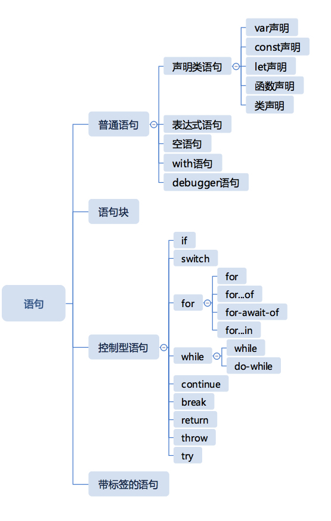
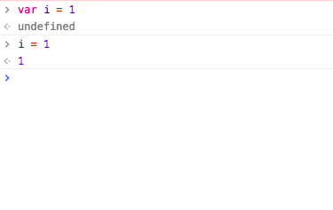
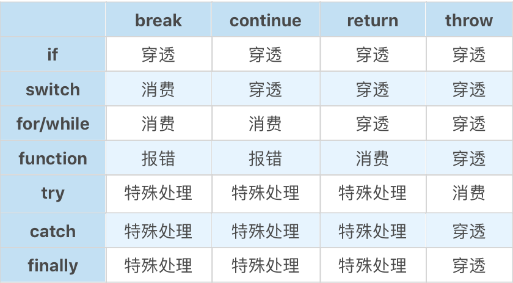

# Completion 类型

#### try - catch - finally 的特殊情况
```js
const func = () => {
  try {
    return 0;
  } catch (err) {
  } finally {
    console.log('run finally');
  }
};

console.log('return: ', func());

// run finally
// return: 0
```

结果是 `return` 执行后并没有立即返回，先执行`finally`中的语句，再返回。


在`finally`中增加`return`的情况:
```js
const func = () => {
  try {
    return 0;
  } catch (err) {
  } finally {
    return 1;
  }
};

console.log('return: ', func());

// return:  1
```
`finally`中的`return`覆盖了`try`中的`return`。


以上运行机制基础是JS语句执行的完成状态，用一个标准来表示就是 `Completion Record` (用户描述异常、跳出等语句执行过程)。

`Completion Record` 表示一个语句执行完之后的结果，有一个字段：
- [[type]] 表示完成的类型，有 break continue return throw 和 normal 几种类型
- [[value]] 表示语句的返回值，如果语句没有，则是 empty
- [[target]] 表示语句的目标，通常是一个JS标签
  
语句分类：



- 普通语句: 不带控制能力的语句
依次执行，没有分支或重复执行逻辑，执行后，会得到[[type]]为 normal 的 Completion Record，JS引擎遇到这样的 Completion Record，会继续执行下一条语句。


Chrome控制台显示的正是语句的 Completion Record 的 [[value]]。

- 语句块: 使用大括号括起来的一组语句，是语句的重合结构，可以嵌套

语句块内部的语句 Completion Record [[type]]如果不为 normal，会打断语句块的后续语句执行。
```js
{
  var i = 1; // normal, empty, empty
  return i; // return, 1, empty
  i ++; 
  console.log(i)
} // return, 1, empty
```

- 控制型语句
带有 if、switch关键字，会对不同的类型的 Completion Record 产生反应。

控制型语句分类:
  - 对内部产生影响: 如 if、switch、while/for、try
  - 对外部产生影响: 如 break、continue、return、throw

break、continue、return、throw 四种类型与控制语句两两组合的效果:


- 带标签的语句
任何JS语句是可以加标签的，在语句前加冒号即可:

```js
  firstStatement: var i = 1;
```
标签语句大部分情况类似于注释，唯一有作用的情况是: **与完成记录类型中的 target 相配合，用于跳出多层循环**。
```js
  outer: while(true) {
    inner: while(true) {
        break outer;
    }
  }
  console.log("finished")
```
break/continue 语句后如果跟了关键字，会产生带 target 的完成记录，一旦完成记录带了 target，则只有拥有应对 label 的循环语句会消费它。

> 穿透和消费，报错应该是连贯的，“穿透”就是指不在当前这一层处理，向外逐层寻找可以“消费”的那一层，直到最后都没找到就报错。


