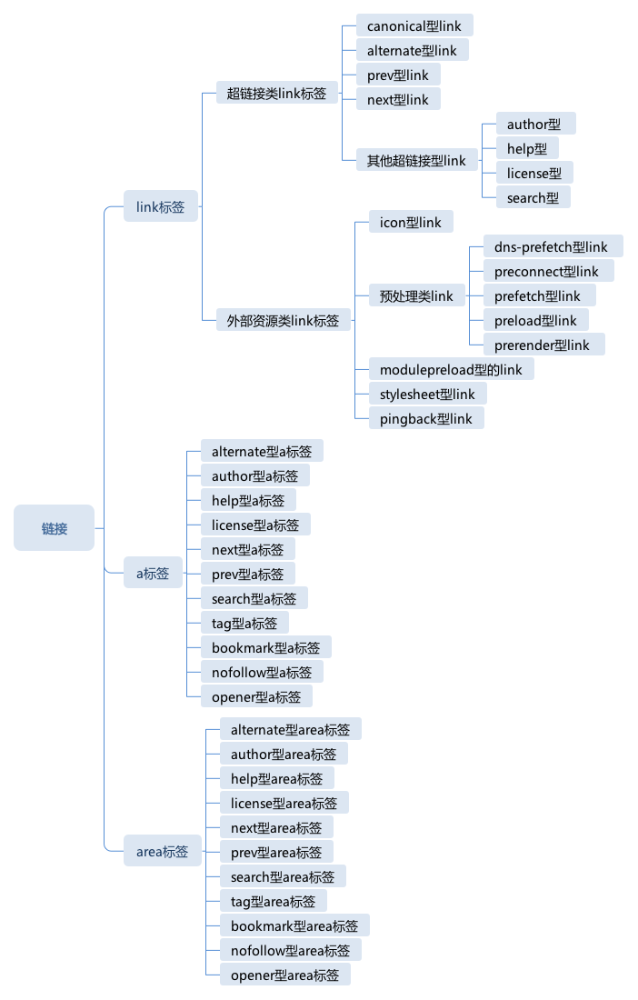

# HTML 链接

HTML 中链接有两种类型, 一种是 超链接型标签, 一种是 外部资源链接.




## link 标签

`link` 标签会生成一个链接, 可能是超链接, 也可能是外部资源链接.

`link` 生成的超链接不会像 `a` 标签那显示在网页中, 多数是为搜索引擎和浏览器插件识别, 如页面 RSS 的 `link` 标签, 能够被浏览器的 RSS 订阅插件识别.

`link` 生成的外部资源链接会实际下载资源, 并做出处理, 如 `link` 标签引入格式表.

`link` 标签的链接类型主要通过 `rel` 属性来区分, 如
```html
<link rel="stylesheet" href="style.css" type="text/css" >
```

### 超链接类 link 标签

被动型链接, 在用户不操作的情况下, 不会被主动下载.

- canonical: 提示页面它的主 URL, 网站中常有多个 URL 指向同一页面, 搜索引擎访问这类页面时会去重, 此 link 会提示保留哪个.
```html
<link rel="canonical" href="..." >
```

- alternate: 提示页面它的变形形式, 变形是指定当面页面内容为不同格式,不同语言或不同设备设计的版本, 常提供给搜索引擎来使用.
```html
<!-- rss订阅 -->
<link rel="alternate" type="application/rss+xml" title="RSS" href="..." >
```

- prev, next
分页浏览或图片展示时用户指定前一项或后一项的内容, 有助于指展示.

`next` 型 `link` 告诉浏览器"这是很可能访问的下一个页面", HTML 标准还建议对 `next` 型 `link` 做预处理.

- 表示跟当前文档相关联信息的 link 标签
  - rel="author": 链接到本页面的作者, 一般是 mailto: 协议
  - rel="help": 链接到本页面的帮助页
  - rel="license" 链接到本页面的版本信息页
  - rel="search" 链接到本页面的搜索页面(一般是站内提供搜索时使用)


### 外部资源类 link 标签

会被主动下载, 并根据`rel`类型不同做处理.

- icon 型 link
用于指定网站图标, 图标地址会默认被浏览器下载和使用.
```html
<link rel="icon" href="x.gif" type="image/gif" sizes="16x16">
```
如果没有使用 icon 型 link 标签, 一般会使用域名根目录下的 `favicon.ico`


### 预处理类 link

- dns-prefetch: 提前对一个域名做 dns 查询
- preconnect: 提前对一个服务器建立 tcp 连接
- prefetch: 提前取 href 指定 url 的内容
- preload: 提前加载 href 指定的 url
- prerender: 提前渲染 href 指定的 url

### modulepreload 型 link

使用是预先加载一个 JavaScript 模块, 保证 JS 模块不必等到执行时才加载.

```html
<link rel="modulepreload" href="app.js">
<link rel="modulepreload" href="helpers.js">
<link rel="modulepreload" href="irc.js">
<link rel="modulepreload" href="fog-machine.js">
<script type="module" src="app.js">
```

### stylesheet 型 link

基本用法是从一个 CSS 文件创建一个格式表, type 可省略, 如不省略必须写 `text/css` 才会生效.

```html
<link rel="stylesheet" href="xxx.css" type="text/css" >
```


## a 标签

`a`标签是 "anchor(锚点)" 的缩写, 当有 `href` 属性时, 它是链接, 当有 `name` 属性时, 它是链接的目标.

当 `a` 标签有 `href` 属性时, 它是链接, 当有 `name` 属性时, 它是链接目标.

`a` 标签也可以有 `rel` 属性:

与 `link` 语义完全一致的标签, 不同的是 `a` 标签产生的链接会实际显示在网页中.
- alternate
- author
- help
- license
- next
- prev
- search

`a` 标签独有的 `rel` 类型:

- `tag`: 表示本网页所属的标签
- `bookmark`: 到上级章节的链接

还有辅助的 `rel` 类型, 用于提示浏览器或搜索引擎做一些处理:

- `nofollow`: 此链接不会被搜索引擎索引
- `noopener`: 此链接打开的网页无法使用 opener 来获得当前页面的窗口
- `noreferrer`: 此链接打开的网页无法使用 referrer 来获得当前页面的 url
- `opener`: 打开的刚刚可以使用 window.opener 来访问当前页面的 window 对象, 这是默认行为

## area 标签
与 `a` 标签不同的是, `area` 表示区域型的链接.
`area` 标签支持的 `rel` 与 `a` 完全一样.

`area` 是整个 html 规则中唯一支持非矩形热区的标签, 它的 shape 属性支持三种类型.

- 圆形: circle 或 circ, coords 支持三个值分别表示两个对角顶点 x1, y1 和 x2, y2
- 矩形: rect 或 rectangle, coords 支持两个值表示两个对角顶点 x1, y1 和 x2, y2
- 多边形: poly 或 polygon, coords 至少包括6个值表示多边型的各个顶点.

area 必须跟 img 和 map 标签配合使用
```html
<p>
 Please select a shape:
 
 <map name="shapes">
  <area shape=rect coords="50,50,100,100"> <!-- the hole in the red box -->
  <area shape=rect coords="25,25,125,125" href="red.html" alt="Red box.">
  <area shape=circle coords="200,75,50" href="green.html" alt="Green circle.">
  <area shape=poly coords="325,25,262,125,388,125" href="blue.html" alt="Blue triangle.">
  <area shape=poly coords="450,25,435,60,400,75,435,90,450,125,465,90,500,75,465,60"
        href="yellow.html" alt="Yellow star.">
 </map>
</p>
```
例子展示了在一张图片上画热区并产生链接, 分别使用了矩形,圆形和多边形三种 area.


