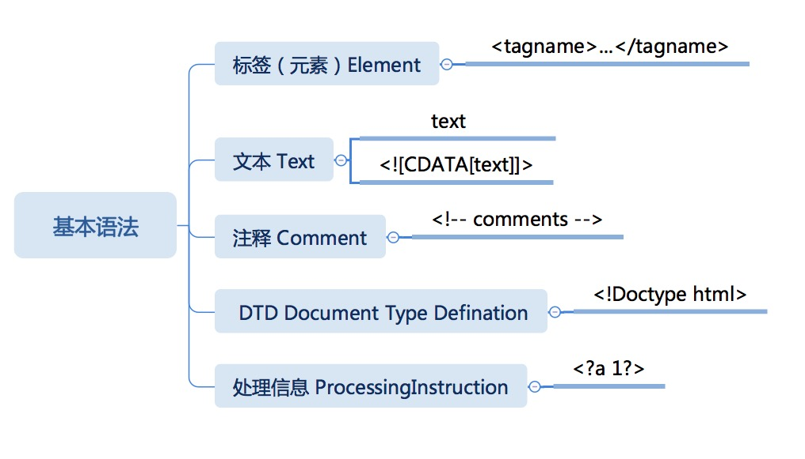

# HTML 语法


## 基本语法



## 标签语法

- 开始标签: <tagname>; 开始标签名称只能使用英文字母
  - 带属性的开始标签: <tagname attributename="attributevalue">
- 结束标签: </tagname>
- 自闭合标签: <tagname />

属性语法中可以使用单引号, 双引号, 或完全不用引号, 需要转义的情况如下:

- 无引号属性: `<tab>` `<LF>` `<FF>` `<SPACE>` `& `五种字符
- 单引号属性: `'` `&` 两种字符
- 双引号属性: `"` `&` 两种字符

## 文本语法

- 普通文本节点
- CDATA文本节点

普通文本节点中只有 `<` 和 `&` 需要转义;
CDATA节点中只有 `]]>` 需要处理, 只能拆成两个CDATA节点

## 注释语法

以 `<!--` 开头, 以 `-->` 结尾, 如果注释内容一定要出现 `-->`, 可以拆成多个注释节点.

## ProcessingInstruction 语法(处理信息)

多数情况下是给机器看的, 但并没有规定它的具体内容, 可以视为一种保留的扩展机制.

## DTD 语法(文档类型字义)

HTML5 规定了一个简单的 DTD:
```html
<!DOCTYPE html>
```

## 文本实体

文本实体就是类似以下的代码
```html
&lt;
&nbsp;
&gt;
&amp;
```

由 `&` 开头, 由 `;` 结束.
文本实体可以用`#`后跟一个十进制数字, 表示 Unicode 值.
除此之外这两个符号之间的内容, 由 DTD 决定.


